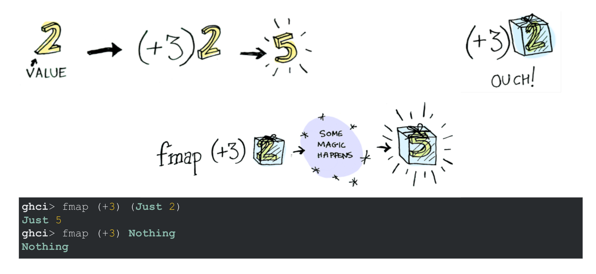
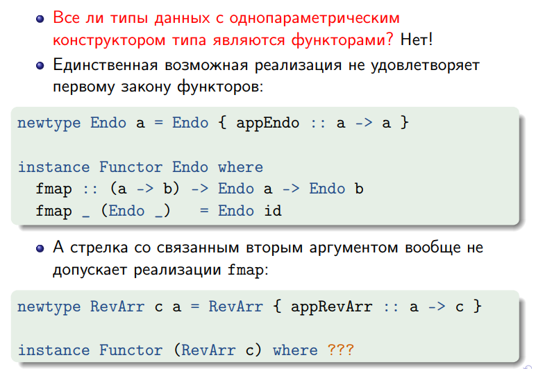

## 14 прак: класс типов Functor и его представители

Представители класса типов Functor должны быть конструкторами типа с одним параметром (то есть f :: * -> *). Функторы задают способ «поднять стрелку на уровень контейнера». Для определения функтора нам необходимо и достаточно задать fmap.

```haskell
class Functor f where
    fmap :: (a -> b) -> (f a -> f b)
```

(<$> — это инфиксный fmap)

<hr/>

### Смысл



Это просто map как для списков, но не только для списков, а для любого контейнера, которому сделаем instal Functor.

<hr/>

Законы:

```haskell
fmap id      = id
fmap (f . g) = fmap f . fmap g
```

Суть в том, что элементы менять можно (и нужно, а то смысл), а вот структуру контейнера менять нельзя. Грубо говоря, у нас же map не может превратить список размера 10 в список размера 9.

Не выполнять их можно (но не нужно). Например:
instance Functor [] where
fmap _ []     = []
fmap f (x:xs) = f x : f x : fmap f xs



<hr/>

Фулл определение класса функтор по станд. либе:
```haskell
infixl 4 <$, <$>, $>
class Functor f where
    -- эти функции можно перегрузить
    fmap :: (a -> b) -> f a -> f b
    (<$) :: a -> f b -> f a     -- вместо функции одно значение, то есть
    (<$) = fmap . const         -- заменяет все элементы контейнера на то, что передали

    -- а вот этих ребят перегрузить нельзя
    (<$>) :: Functor f => (a -> b) -> f a -> f b
    (<$>) = fmap
    ($>) :: Functor f => f a -> b -> f b
    ($>) = flip (<$)
```

Как работает: стрелочка смотрит туда, откуда берётся значение.
Примеры для понимания, как работают половинчатые кусочки доллара:
```
> Just 42 $> "foo"
Just "foo"
> Nothing $> "foo"
Nothing
> Nothing <$ "foo"
[Nothing,Nothing,Nothing]
```

Дополнительные стандартные функции из `Data.Functor`
```haskell
void :: Functor f => f a -> f ()
void x = () <$ x

infixl 1 <&>        -- Недавно: Base 4.11.0.0 GHC 8.4.1 (Mar 2018)
(<&>) :: Functor f => f a -> (a -> b) -> f b
xs <&> f = f <$> xs -- другой стороной просто, ровно как $ <-> &
```

Примеры применения
```
> void "ABCD"
[(),(),(),()]
> (+10) <$> (^2) <$> [1,2,3]
[11,14,19]
>[1,2,3] <&> (^2) <&> (+10)
[11,14,19]
```

## Представители класса `Functor`

Для списка и для `Maybe`
```haskell
instance Functor [] where
    fmap _ []     = []
    fmap f x:xs = f x : fmap f xs

instance Functor Maybe where
    fmap _ Nothing  = Nothing
    fmap f (Just x) = Just (f x) 
```
для дерева:

```haskell
data Tree a = Leaf a | Branch (Tree a) a (Tree a)

instance Functor Tree where
    fmap :: (a -> b) -> (Tree a -> Tree b)  -- InstanceSigs
    fmap f (Leaf x)       = Leaf (f x)
    fmap f (Branch l x r) = Branch (fmap f l) (f x) (fmap f r)
```

Пример работы:
```GHCI
> testTree = Branch (Leaf 2) 3 (Leaf 4)
> fmap (^2) testTree
Branch (Leaf 4) 9 (Leaf 16)
> (^3) <$> testTree
Branch (Leaf 8) 27 (Leaf 64)
```

### Представители класса `Functor` для двухпараметрических типов данных

Стнадартные двухпараметрические типы данных: `Either`, `(,)` — пара, `(->)` — частично применённая стрелка. Требуется связать первый параметр, чтобы можно было объявить их представителями функтора, так как иначе они не сходятся по кайнду (нам надо * -> *).

Представитель класса `Functor` для `Either`:
```haskell
instance Functor (Either e) where   -- e от слова error
    fmap :: (a -> b) -> Either e a -> Either e b
    fmap _ (Left x)  = Left x
    fmap g (Right y) = Right (g y)
```

Представитель класса `Functor` для пары:

```haskell
instance Functor ((,) s) where
    fmap :: (a -> b) -> (s, a) -> (s, b)
    fmap g (x, y) = (x, g y)
```

Представитель класса `Functor` для частично применённой стрелки:

```haskell
instance Functor ((->) e) where     -- e от слова environment
    --fmap :: (a -> b) -> ((->) e a) -> ((->) e b)    --  мы должны написать такую конструкцию
    -- но если мы её распишем и развернём все частичные применения, то получим
    fmap :: (a -> b) -> (e -> a) -> (e -> b)    -- а это просто композиция 
    fmap = (.)
```

Неформально это можно описать как "здесь лежит рецепт, как по типу e получить тип a", потому что в понимание контейнера частично применённая стрелка как-то в мозгу не укладывается. Тогда если у тебя есть рецепт, как получать из у значение типа а, и есть функция из а в b, то ты можешь получить рецепт, как получить из e значение типа b.


